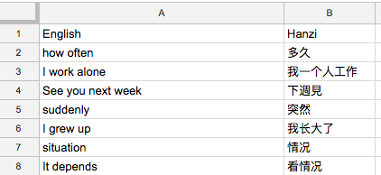

# google-translate-collector

Allows you to take a bunch of phrases in your native language and turn them into an mp3 recording in your target language. Meant for people who learn languages better from hearing.

It also helps you revise for your language class hands-free, which is huge for your productivity and cognitive comfort.  
Not to mention your neck will thank you for this.

Note: this is still work in progress and the UX is far from great.  
Will keep working on it ;)

The only supported language combination for now is:  
Source Language: English (what you speak)  
Target Language: Mandarin (what you want to learn)

## Requirements

• Docker  
• Account on Microsoft Azure (free)

## Usage

This app is currently optimized for people who keep their language notes in Google Translate.  
It takes a CSV file as input (you can export your Favourites from Google Translate as a CSV).  
The CSV is expected to have two columns with headers 'English' and 'Hanzi' (Hanzi is what Chinese characters are called).  
Check out the example file in `/csv_inputs`.

1.  Create a new account with Azure (to get access to their Text-To-Speech services).
2.  From your Azure account dashboard, create new 'app' in Cognitive Services.
3.  Copy the key generated by Azure for that app.

4.  At Command Line:  
    `BING_KEY=<whatever your bing subscription key is>`  
    `docker build --build-arg BING_KEY=$BING_KEY -t mandarin .`  
    `docker run -v $PWD/mp3_outputs:/app/mp3_outputs mandarin`

## Troubleshooting

`bingtts.BadRequestException: 503 Service Unavailable`  
Happens if you fail to sort input properly beforehand - for example if you had an English phrase in Hanzi column. These should be caught automatically, so you shouldn't see this error at all.

## Notes:

This program uses recording of silence made available by Andrew Hardwick:  
http://duramecho.com/Misc/SilentCd/
